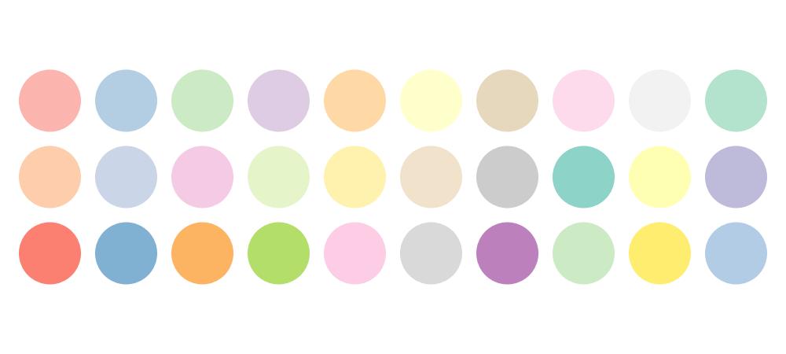
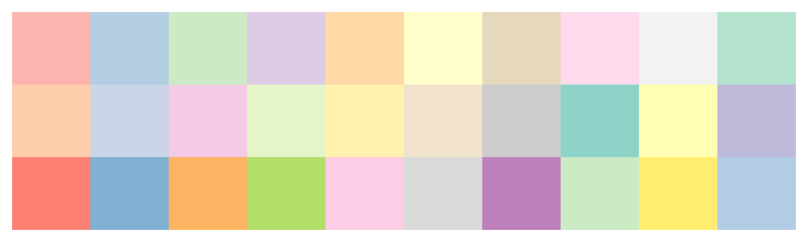
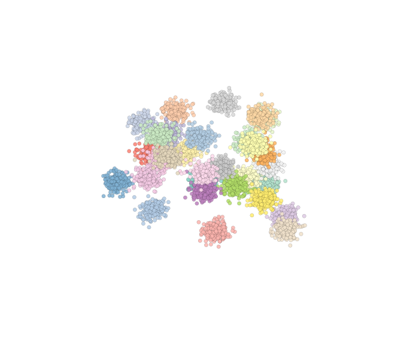
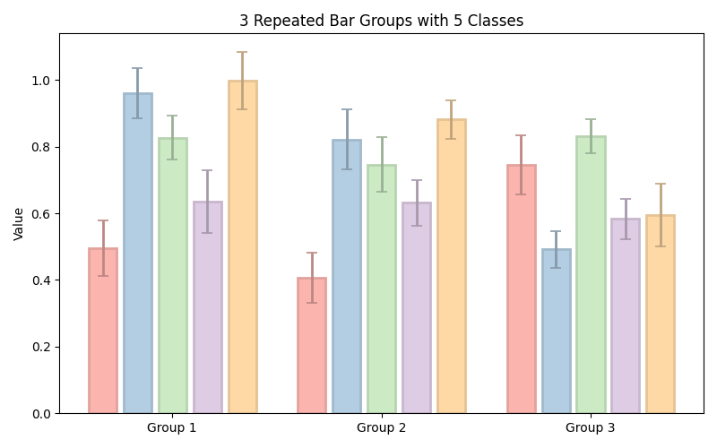
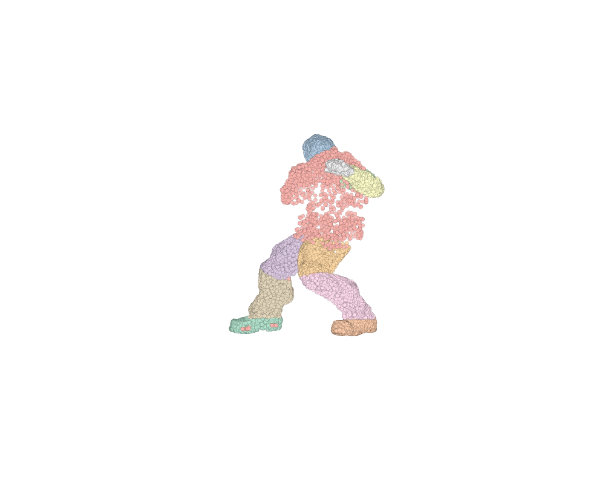
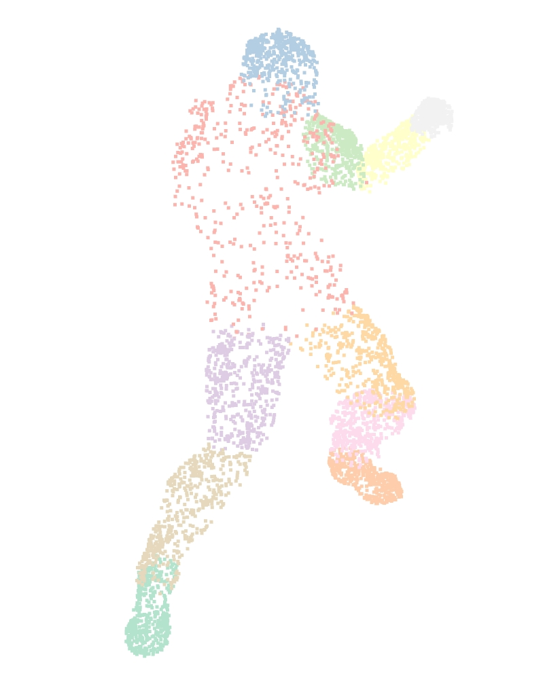
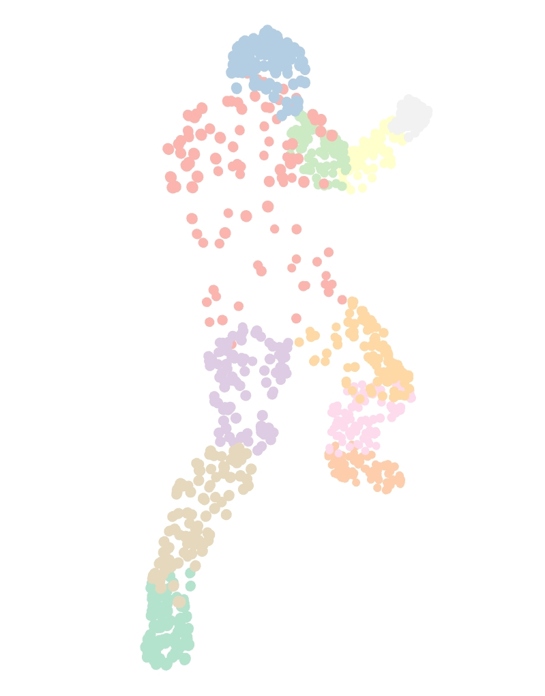

# SIGGRAPH-GS-ColorVis

**SIGGRAPH-GS-COLORVIS** is a lightweight color utility designed to assist with consistent and visually appealing SIGGRAPH-style color assignments for multi-class data visualization, particularly in `.ply` point cloud segmentation tasks.

The core module is `color_generator.py`, which can be integrated into any project requiring high-quality category-wise color generation. Other scripts serve as optional testing and demonstration tools.

---

## 🎨 1. `color_generator.py`: Consistent Color Generation

### 📥 Installation

Clone the repository:

```bash
git clone git@github.com:Sycamore-Ma/SIGGRAPH-GS-ColorVis.git
cd SIGGRAPH-GS-ColorVis
```

Prepare the environment:

```bash
conda create -n colorvis python=3.10
conda activate colorvis
pip install -e .
```

> 💡 Tip for Windows users:  
> If you prefer not to use `conda`, you can use your system-wide Python and install dependencies with:
> 
> ```bash
> pip install matplotlib numpy open3d plyfile
> ```

### Usage

Simply copy the file to your project directory:
```bash
cp color_generator.py path_to_your_project/
```
> Don't forget to switch the conda environment to `your_env` if you want to keep working on your own project.


In your Python script where you want to use the color generator, import the class and create an instance:

```python
from color_generator import generate_colors

# Example usage
num_classes = 10  # Number of classes
color_list = generate_colors(num_classes)
print(color_list)
Print(type(color_list))
```
The return value is a list of RGB tuples, each representing a color for a class. The RGB values are in the range of 0.0 to 1.0.

<!-- import the figure here -->
### Example of the output
<table>
  <tr>
    <td></td>
    <td></td>
    <td></td>
    <td></td>
    <td></td>
  </tr>
  <tr>
    <td align="center">Circle</td>
    <td align="center">Stripe</td>
    <td align="center">Cluster</td>
    <td align="center">Cluster 3D</td>
    <td align="center">Bar Plot</td>
  </tr>
</table>

<table>
  <tr>
    <td></td>
    <td></td>
    <td></td>
    <td></td>
  </tr>
  <tr>
    <td align="center">Matplotlib Point</td>
    <td align="center">Open3D Point</td>
    <td align="center">Open3D (No Light)</td>
    <td align="center">Gaussian 3D (No Light)</td>
  </tr>
</table>

## 🧪 2. `test_color_generator.py`: Testing the Color Generator
This script is designed to test the functionality of the `color_generator.py` module. It generates a set of palettes, point clusters, plots, or others with a specified number of classes and visualizes them using `matplotlib`. 

### Testing with different counts of colors
The first argument is the number of colors to generate:
```bash
cd SIGGRAPH-GS-ColorVis
python colors_test.py 10
python colors_test.py 20
python colors_test.py 60
```

### Testing with different palettes
... and the second argument is the palette type. The palette type can be one of the following:
```bash
python colors_test.py 30 all
python colors_test.py 30 circle
python colors_test.py 30 stripe
python colors_test.py 30 cluster
python colors_test.py 30 cluster3d
python colors_test.py 5 plot
```


## 🧪 3. `render_ply_matplotlib.py` and `render_ply_open3d.py`: Testing the Gaussian Rendering
These scripts are designed to test the Gaussian rendering of point clouds using `matplotlib` and `open3d`. They load a `.ply` file, extract the point cloud data, and visualize it using the specified library.
The header format of the `.ply` file is as follows:
```
ply
format ascii 1.0
element vertex 63720
property float x
property float y
property float z
property uchar red
property uchar green
property uchar blue
property int seg_id_l1
property int seg_id_l2
property int seg_id_l3
property int seg_id_l4
property float qw
property float qx
property float qy
property float qz
property float sx
property float sy
property float sz
property float alpha
end_header
```

### Usage
To run the scripts, use the following commands:

```bash
python render_ply_matplotlib.py ply/gaussian.ply
python render_ply_open3d.py ply/gaussian.ply
```

## 📜 4. TO-DO: `Blender` or `Houdini` Pathway
The `Blender` or `Houdini` pathway is currently not implemented. The goal is to create a script that can be run in the `Blender` or `Houdini` environment to visualize the generated colors and point clouds. This will allow for more advanced rendering and visualization options, potentially including animation and more complex lighting effects.

